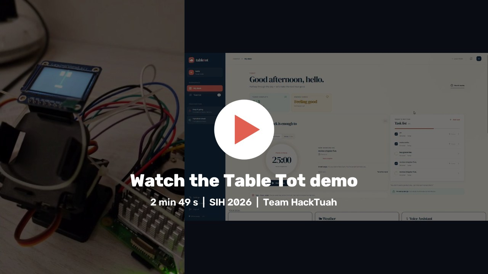
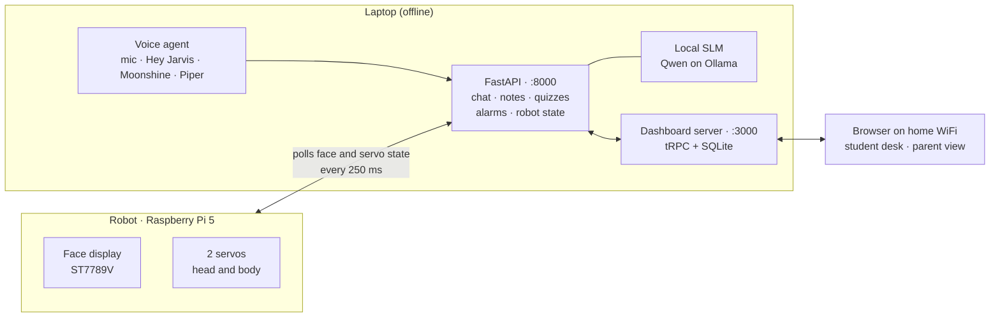
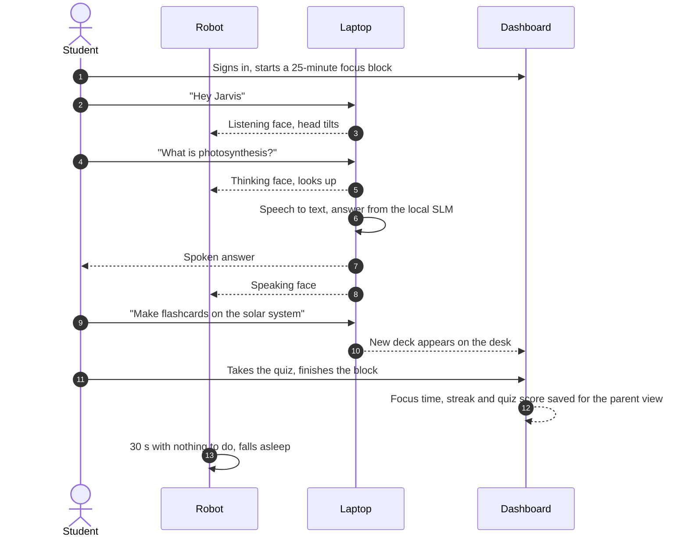
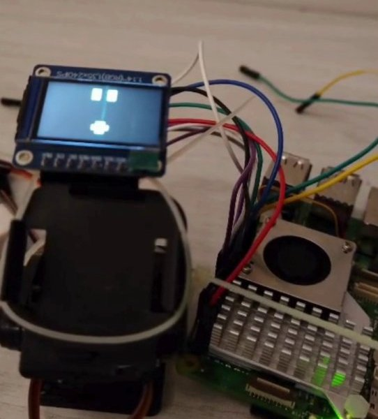
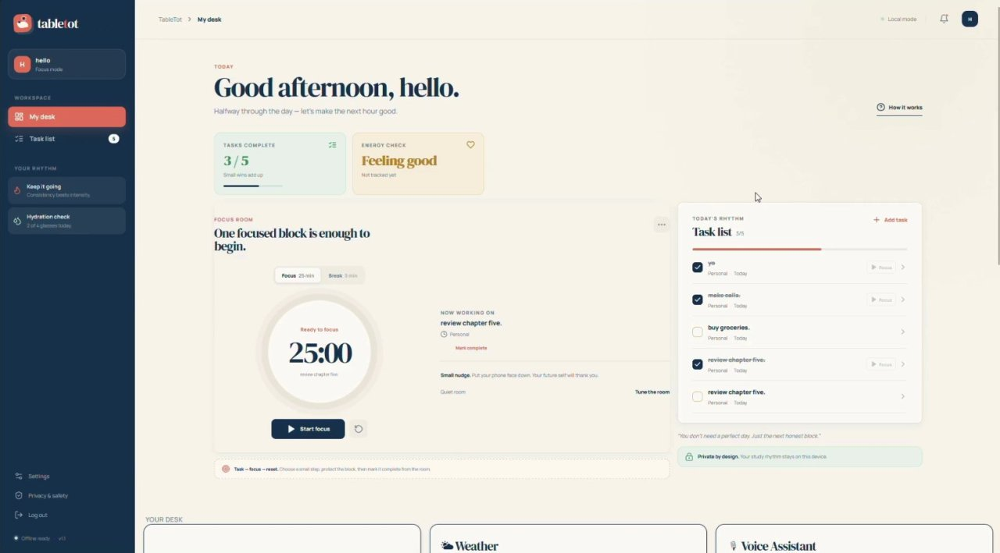
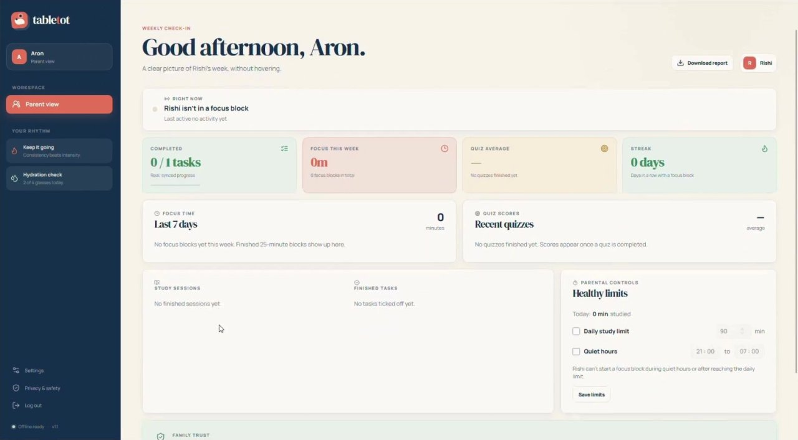
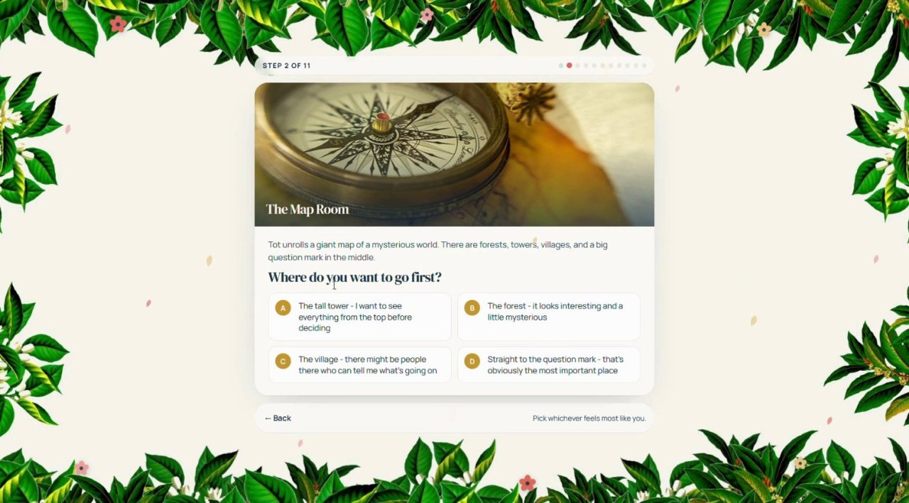
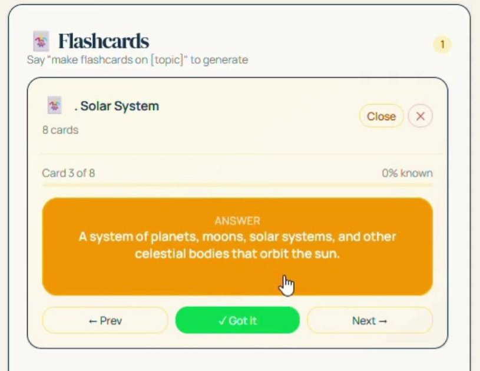

<div align="center">

# Table Tot

**A study buddy that sits on the desk, not in a tab.**
A small robot with a face and two servos that answers doubts out loud, turns any topic into a quiz or flashcards, and keeps the study session on track.
Everything runs on the family laptop. No internet needed.

Smart India Hackathon 2026 · PS SIH26224 · Smart Education · Hardware · Team HackTuah

<a href="https://drive.google.com/file/d/1g4RysGRt5eFyuDaAKFRs-mw6mppIXEU0/view?usp=drivesdk"></a>

**[▶ Watch the demo video](https://drive.google.com/file/d/1g4RysGRt5eFyuDaAKFRs-mw6mppIXEU0/view?usp=drivesdk)** (2 min 49 s) · **[Pitch deck](https://docs.google.com/presentation/d/1UuR3PBAGwim2hcJXAsRA2YukOUMFK2f5/edit?usp=sharing&ouid=100875344168070587847&rtpof=true&sd=true)**

</div>

---

## What is in this repository

Table Tot has three parts, and all three live here.

| Part | What it does | Where |
|---|---|---|
| Robot | Raspberry Pi 5 with an ST7789V face display and two servos (head and body). It asks the laptop what to show and plays the face and gestures. | [`hardware/`](hardware), [`pi_server/`](pi_server) |
| Laptop brain | FastAPI on port 8000 and a voice agent using the laptop's mic and speakers: wake word, speech to text, text to speech, a local SLM through Ollama, notes, quizzes, flashcards, alarms and robot state | [`ml/`](ml), [`learner/`](learner), [`persona/`](persona) |
| Dashboard | React + Vite web app on port 3000, for the student's desk and the parent view | [`dashboard/`](dashboard) |

## Why

- **Self-study has no structure.** Nobody sets the timer, plans the revision or checks that the chapter actually went in. Table Tot does, every session.
- **Study apps are easy to ignore.** A notification is swiped away. A robot that looks up, thinks and answers when you call it is harder to ignore.
- **Parents can't see progress.** They either hover or guess. The parent view shows focus time, streaks and quiz scores, and nothing more.

## How it fits together



The Pi does no thinking. Four times a second it asks the laptop which face to show and which gesture to play. The browser talks to the dashboard server, and straight to FastAPI for voice, notes uploads and live alarm events. Speech, answers, notes and study records all stay on the laptop. Hard questions don't go to the cloud: the same local model answers again with more time to think.

## A study session, end to end



## The robot

<table>
<tr>
<td width="45%"></td>
<td>

- **Face.** A small ST7789V IPS display (240 × 320) shows the robot's moods: idle, happy, listening, thinking, speaking, focus and sleeping. After 30 seconds of nothing, it dozes off with floating Zs.
- **Head and body.** Two servos on a pan-tilt mount tilt to listen, look up to think, bob while speaking and sway gently when idle.
- **Brain.** A Raspberry Pi 5 drives the parts and polls the laptop for what to do. The laptop's mic and speakers carry the voice.

Wiring is in [`hardware/CONNECTIONS.md`](hardware/CONNECTIONS.md).

</td>
</tr>
</table>

## The dashboard

| | |
|---|---|
| **Student desk.** A focus timer, today's task list and small nudges to drink water and put the phone away. Widgets below for the clock, weather, alarms, notes (type them or upload a PDF or photo) and the voice assistant.<br/><br/> | **Parent view.** What the child is doing right now, the week's tasks, focus time, quiz average and streak, and healthy limits: a daily study cap and quiet hours. A parent needs the child's PIN to link.<br/><br/> |
| **Onboarding.** An 11-step story instead of a form. Each choice feeds the learner profile that sets Tot's tone, hints, answer length and teaching style.<br/><br/> | **Flashcards and quizzes by voice.** Say "make flashcards on the solar system" or "quiz me on fractions" and the local SLM builds the deck or quiz. Scores from the dashboard go to the parent view.<br/><br/> |

## Things to say

The wake word is **"Hey Jarvis"**.

| Say | What happens |
|---|---|
| "What is photosynthesis?" | Spoken answer from the local SLM |
| "Make a quiz on the solar system" | A new quiz on the desk |
| "Make flashcards on fractions" | A new flashcard deck |
| "Take a quiz on geography" | A spoken quiz, answered out loud |
| "Set a timer for ten minutes" | Starts a timer |
| "Set an alarm for 7 am" | Adds an alarm |
| "Note that the test is on Friday" | Saves a note |
| "Remind me to buy milk" | Adds a task |
| "What's the weather in Chennai?" | Current weather |
| "Help me set up my persona" | Ten quick questions that tune how Tot talks |

## Running it

Full setup is in [`RUNNING.md`](RUNNING.md). The short version, on the laptop (Git Bash on Windows):

```bash
# once
pip install -e ".[api,test]"
pip install -r ml/requirements.txt
ollama pull qwen3:0.6b
cp ml/.env.example ml/.env
cd dashboard && pnpm install && cd ..

# every time
bash run.sh                   # FastAPI and the voice agent, http://localhost:8000
cd dashboard && pnpm dev      # dashboard, http://localhost:3000
```

On the Pi, run `bash hardware/run.sh`. To have the Pi ring for alarms and timers too, also run `python3 pi_server/app.py` and set `PI_HOST` in `ml/.env`. Power-on order is in [`START_ROBOT.md`](START_ROBOT.md), and wiring is in [`hardware/CONNECTIONS.md`](hardware/CONNECTIONS.md).

## Privacy

- There is no camera. Voice is turned into text on the laptop and the audio is not kept.
- Answers come from a model on the laptop. Nothing is sent to a cloud AI.
- Anything typed into chat has names, phone numbers, emails and addresses scrubbed before the model sees it.
- The dashboard only runs on the home network. PINs are hashed, repeated wrong guesses lock the account, and a parent needs the child's PIN to link.
- The only internet call is the optional weather widget.

## Layout

```
dashboard/        React + Vite app and its Node server (tRPC, SQLite)
hardware/         Pi face display and servo bridge, wiring docs
pi_server/        optional Pi service that rings for alarms and timers
ml/               laptop FastAPI and voice agent: chat, notes, quizzes, flashcards, alarms, robot state
learner/          onboarding questionnaire, learner profile and teaching policy
persona/          Tot's phrases, persona prompt and voice settings
docs/screenshots/ the images in this README
```

## Built with

Python, FastAPI, Ollama with Qwen, openWakeWord, Moonshine, Piper, PyMuPDF, SQLite with FTS5, React, Vite, TypeScript, tRPC and Tailwind CSS, on a Raspberry Pi 5.

## Credits

Team HackTuah, for Smart India Hackathon 2026. The pitch deck is on [Google Slides](https://docs.google.com/presentation/d/1UuR3PBAGwim2hcJXAsRA2YukOUMFK2f5/edit?usp=sharing&ouid=100875344168070587847&rtpof=true&sd=true), and a copy is in [`SIH2026-Presentation-HackTuah-TableTot.pptx`](SIH2026-Presentation-HackTuah-TableTot.pptx).

The onboarding photos are CC0 and public-domain images. Sources are in [`dashboard/client/public/onboarding/ATTRIBUTION.md`](dashboard/client/public/onboarding/ATTRIBUTION.md).
